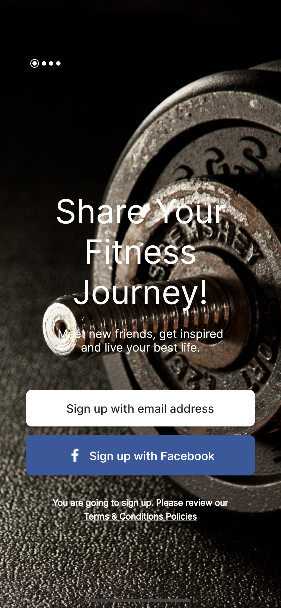
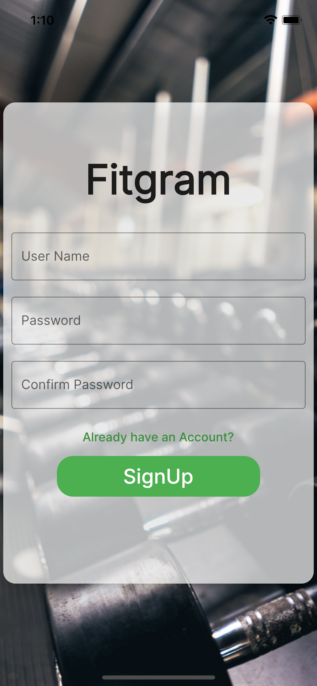
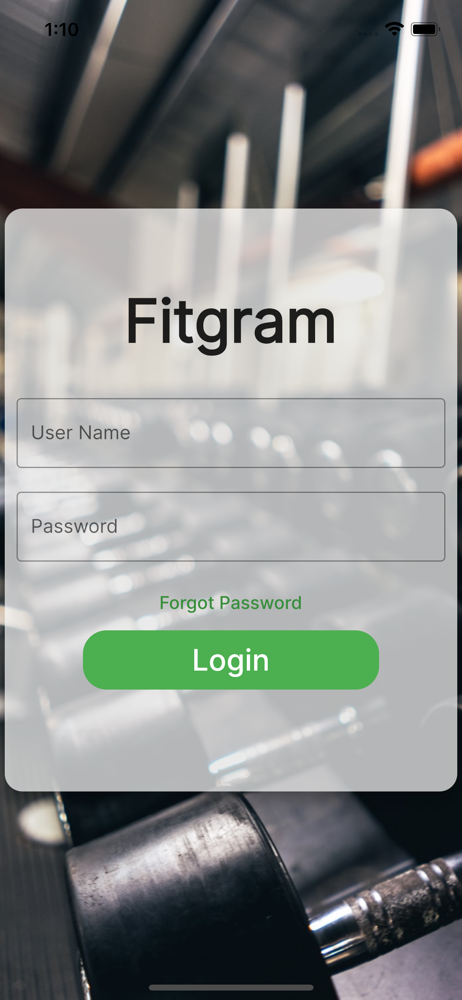
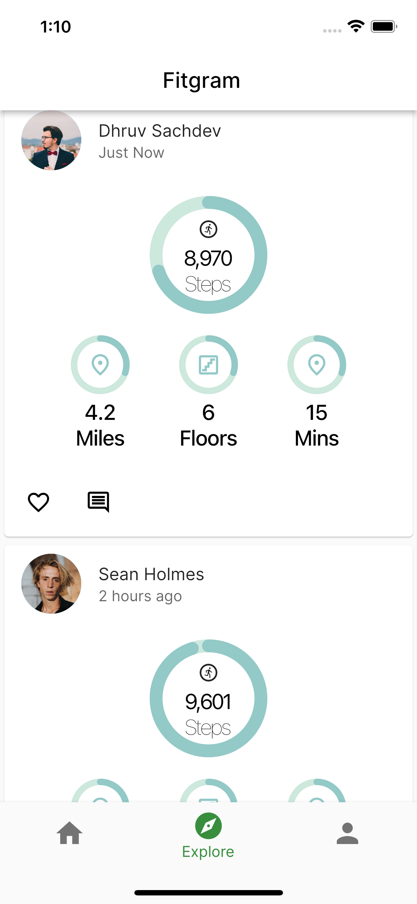
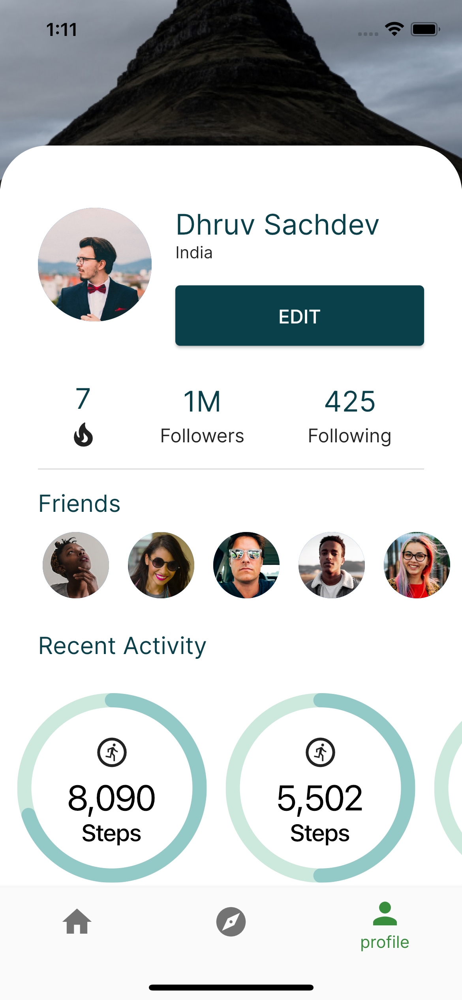
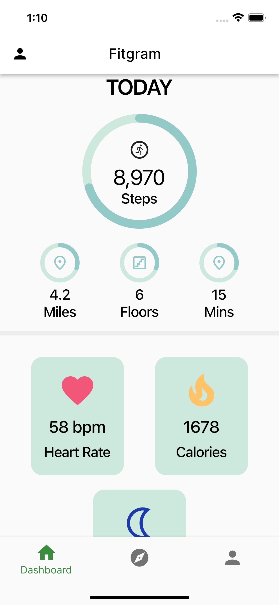

# Fitgram

## About

*__This project tries to solve for Good Health & Wellbeing, which is one of the United Nations Sustainable Development Goals working towards eliminating the struggle of availing medical treatment during the time of need. Due to COVID and even otherwise, getting hospital beds is really difficult, at least in a crowded city like Mumbai.__*

## What are we making

Here's our demo video

## How to run

#### Setting up the environment

- First Clone this Project on your local machine 
- Open the folder in any ide of your choice, connect your phone/emulator and run the `main.dart` file.
- If you are using terminal to run the following commands  
`cd fitgram/`  
 `flutter pub get`  
*make sure you have a emulator running or a physical device connected to your computer*  
 `flutter run`

*PS: Grab a cup of coffee, it takes some time to build*

- Once the app is built successfully, you'll see a welcome screen and post login:

 <table>
   <tr>
    <td></td>
    <td></td>
    <td></td>
  </tr>
  <tr>
<td></td>
    <td></td>
    <!-- <td></td> -->
  </tr>
</table>

### Contributors
- [Dhruv-Sachdev1313](https://github.com/Dhruv-Sachdev1313)

## Recognition
This repository/project is a submission to [MLH HackFit](https://organize.mlh.io/participants/events/7563-hackfit).

<footer>
Made with ❤️
</footer>

